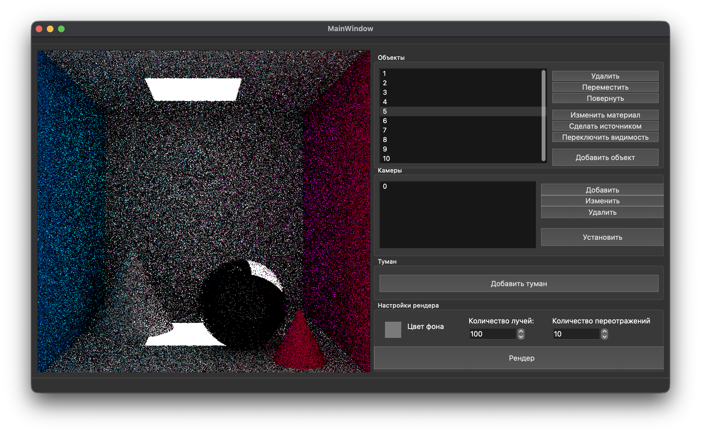
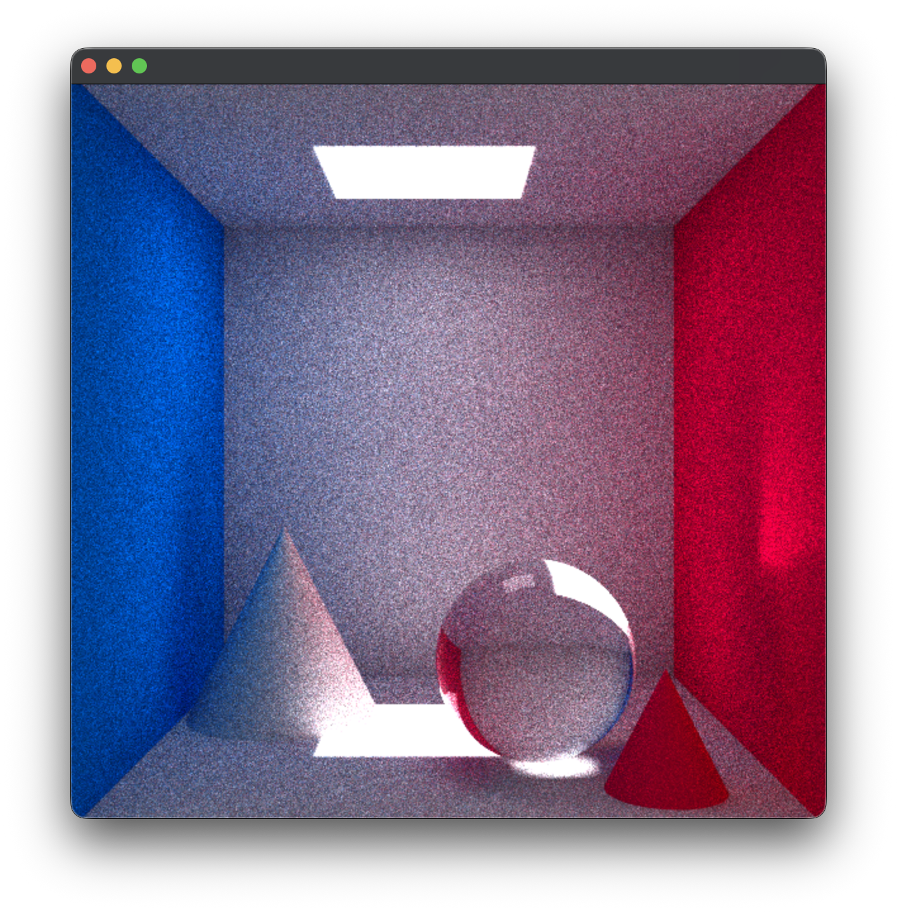

# Курсовая работа по компьютерной графике
## Визуализация сцены с туманом

Была сделана визуализации сцены с помощью алгоритма трассировки путей (Pathtracing). Вычисления выполнятся на CPU, но в тредпулле на N воркеров.

### Интерфейс
Производительности хватает под livetime-render с уменьшением параметров. Окно рендера может масштабировать, но лучше его не трогать, если у вас не супермощный ноут.

Есть возможность добавить геометрические источники, свет, камеры. У объектов можно менять свойства материалов. Киллер фича — [volume scatter](https://docs.blender.org/manual/en/latest/render/shader_nodes/shader/volume_scatter.html). Если хорошо поиграться с настройками, то можно визуализировать туман

### Результат рендера



## Техническая реализация
Программа написана на `c++`, задача на рендер параллелится на тайлы по NxN пикселей и каждый отправляется на расчет воркер. Для интерфейса используется фреймворк `QT`.

## Как запустить
```bash
cd src
make build
./build/app.exe
```

### Доп информация
Вся основная информация по курсачу есть в РПЗ в /report